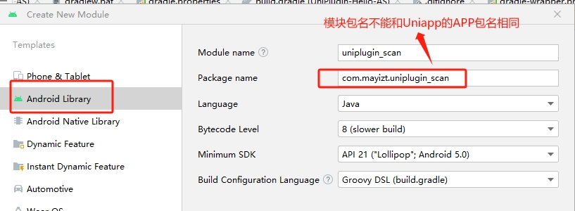

# 为Uniapp插上增强翅膀，安卓原生插件开发

当HBuilderX中提供的能力无法满足App功能需求，需要通过使用Andorid/iOS原生开发实现时，可使用App离线SDK开发原生插件来扩展原生能力。
  


官方教程：[https://nativesupport.dcloud.net.cn/NativePlugin/](https://nativesupport.dcloud.net.cn/NativePlugin/)     
教程学习参考某个CSDN博主，非常感谢：[深圳程序员打工崽:uniapp插件开发](https://blog.csdn.net/weixin_39246975/article/details/129078281)     
本文转为视频教程：[https://github-minknown.oss-cn-beijing.aliyuncs.com/uniapp-aar.mp4](https://github-minknown.oss-cn-beijing.aliyuncs.com/uniapp-aar.mp4)    

**概念前言**：
下文我们可能会用AS表示AndroidStudio，我们还假设了一些内容：
1. uniapp的APP包名为com.mayizt。
2. AS新建的模块包名为com.mayizt.uniplugin_scan。
3. 模块名称uniplugin_scan(建议和模块包名有后缀一致性)。
4. 插件名字和新建的类名均为为Scan。

**如无特殊说明，androidManifest.xml表示新建模块下的androidManifest.xml（位于Src目录），如有androidManifest.xml(app)括号指示，代表app目录下的androidManifest.xml。**

## 第一步：安装AndroidStudio
[尝试点此](https://developer.android.com/studio?hl=zh-cn) 从谷歌官网下载安装AndroidStudio(AS)，我们这里用Giraffe的2022.3.1.21-windows.exe安装包版本。 如链接失效请自行网络搜索下载。
>文件哈希值校验：d07cefc5e9b3a223ac64ca73096c96e9c45bd0e61aa3563388f111acc718a634 

## 第二步：下载SDK
这里指的不是AS的AndroidSDK，而是Uni插件提供的插件开发SDK实例包。从uniapp官网教程下载即可。它是一个大概300MB的压缩包。 
这里提供已给uniapp官网下载链接，但可能会随着页面改版而失效：
[点此直入SDK实例包下载](https://nativesupport.dcloud.net.cn/AppDocs/download/android.html#)
>有关于安卓SDK和JAVA环境，请在AS启动时初始化自行安装即可(这一步也是必须的)。

## 第三步：导入项目并新建moudle
1. 将UniPlugin-Hello-AS项目导入到AS中。
2. 将左上角切换至project模式，右键新建模块。
3. 将左侧切换至Android library（moudle），填上你的模块包名package-name后点点击Finish。**记住不能跟uniapp打包时候的包名相同，这是个坑uniapp不兼容）**。
4. 检查app目录下libs目录下是否有uniapp-release.aar（v8）,如果没有的话需要进入SDK目录(示例SDK压缩包有这个目录)copy一份过来。


>如果导入包后IDE右下角Gradle和索引加载进度条跑完，SycnNow后产生错误，尤其是org.codehaus.groovg.control和Unsupported java错误，请参考本文结尾的附件，关于[JAVA版本适配问题]去解决。这个问题很容易遇到。

## 第四步：添加依赖和代码
给新建的module（uniplugin_scan是我自己新建模块）添加依赖:找到该木块目录下的build.gradle文件，如没有请新建该文件即可。
添加完成点击顶部的Sycn now完成同步。
````java
plugins {
    id 'com.android.library'
}
android {
    compileSdkVersion 33
    defaultConfig {
        minSdkVersion 21
        testInstrumentationRunner "androidx.test.runner.AndroidJUnitRunner"
        consumerProguardFiles "consumer-rules.pro"
    }
    buildTypes {
        release {
            minifyEnabled false
            proguardFiles getDefaultProguardFile('proguard-android-optimize.txt'), 'proguard-rules.pro'
        }
    }
    compileOptions {
        sourceCompatibility JavaVersion.VERSION_1_8
        targetCompatibility JavaVersion.VERSION_1_8
    }
}
repositories {
    flatDir {
        dirs 'libs'
    }
}
dependencies {
    compileOnly fileTree(dir: 'libs', include: ['*.jar'])
    compileOnly fileTree(dir: '../app/libs', include: ['uniapp-v8-release.aar'])
    implementation 'androidx.recyclerview:recyclerview:1.0.0'
    implementation 'androidx.legacy:legacy-support-v4:1.0.0'
    implementation 'androidx.appcompat:appcompat:1.0.0'
    implementation 'com.alibaba:fastjson:1.1.46.android'
    implementation 'com.facebook.fresco:fresco:1.13.0'
    testImplementation 'junit:junit:4.12'
}

````
>如同步产生Could not find method compileOnly() for arguments [directory 'libs']错误，很可能是该文件内容有缺陷或有误导致的。可考虑去除plugins和android字段。    
>如同步产生No signature ofm.android0 is applicable for arg Try Again Open ‘Build’ View Show Log in Explorer等其他错误，请删除模块下build.gradle文件android节点的namespace，再在找到androidManifest.xml添加模块包名，再点击 file —> sync project whit Gradle Files 进行同步即可。添加模块包名的内容参考如下：
````
<manifest xmlns:android="http://schemas.android.com/apk/res/android" package="com.mayizt.uniplugin_scan" >
````

## 第五步：编写模块功能
在main中新建JAVA类,假设类名为Scan：
````java
package com.mayizt.uniplugin_scan;
import com.alibaba.fastjson.JSONObject;
import io.dcloud.feature.uniapp.annotation.UniJSMethod;
import io.dcloud.feature.uniapp.bridge.UniJSCallback;
import io.dcloud.feature.uniapp.common.UniModule;
//这是一个求和并返回的方法函数。
//一定要继承UniModule和使用UniJSMethod注解，才能使用js调用
// uiThread=true表示是否进入uni界面线程执行，=false表示单开线程，根据代码负荷决定即可。
public class Scan extends UniModule {
    @UniJSMethod(uiThread = true)
    public void  add (JSONObject json, UniJSCallback callback) {
        final int a = json.getInteger("a");
        final int b = json.getInteger("b");
        callback.invoke(new JSONObject() {{
            put("code", 0);
            put("result", a + b);
        }});
    }
}
````


## 第六步：准备打包
1. 找到androidManifest.xml,这一步骤是必须的，注意，如果您在该文件中的manifest节点没有添加package, 此处的android:name必须为包名+类名，即com.mayizt.uniplugin_scan.Scan。如有有则“.类名”即可。
````xml
 <application>
        <activity android:name=".Scan"
            android:theme="@android:style/Theme.DeviceDefault.Light.NoActionBar"></activity>
    </application>
````
2. 在build.gradle(app)中添加uniapp-插件，点击sync now

3. 在dcloud_uniplugin.json中新增插件，注意：插件命名会在uniapp中引用


## 第七步：正式打包
1. 将模块打包成插件aar文件，点击右侧面板的Gradle,找到你的模块名,other->assmbleRelese。
>如果不存在assmbleRelese，可进入Seting,找到Experimental,去启动build Gradle task list during Gradle sync再重启AS即可。

2. 打包完成，会在模块下有一个bulid->outputs，有个aar文件复制到电脑桌面上一个android的空目录文件夹，同时桌面上新建空白的package.json文件。
3. 新建一个以插件名Scan为目录名的文件夹，将上述android文件夹和package.json文件放置进入。
4. package.json的内容如下：
>根节点的name必须和id相同，也必须和plugins节点的name相同,代表插件名字。plugins节点class必须是模块包名+类名。
````json
{
	"name": "Scan",
	"id": "Scan",
	"version": "1.0.0",
	"description": "这是一个通过原生JAVA开发的AAR插件",
	"_dp_type": "nativeplugin",
	"_dp_nativeplugin": {
		"android": {
			"integrateType": "aar",
			"plugins": [{
				"type": "module",
				"name": "Scan",
				"class": "com.mayizt.uniplugin_scan.Scan"
			}],
			 "minSdkVersion": "19"
		}
	}
}
````
它的目录结构是如图所示的，到这一步这个Scan的文件夹就是你的插件包了。


## 第八步：引用
1. 在uniapp工程目录下新建nativeplugins文件夹，将上述插件文件夹复制到该目录。找到manifest.json的插件面板，添加本地插件选中您的插件即可。

2. 打包基座（发行->原生APP云打包），选择证书并选择基座。确认打包基座即可。
>如打包基座产生MinSDK版本错误，可到App其他常用设置中修改mixSDK的值为21.或检查模块下build.gradle的android->minSdkVersion

3. 最后是代码调用，使用uniapp自带的requireNativePlugin函数方法引入。
````js
const testModule = uni.requireNativePlugin('Scan')
					testModule.add({
					  a:8,b:4
					},e=>{
					  uni.showToast({
						title:JSON.stringify(e),
						icon:'none'
					  })
					})
````


4. 最后，运行，运行到模拟器或手机，注意选择您刚才打包的基座才行，接下来就能看到效果了。

## 附文：JAVA版本适配问题
选择导入的项目UniPlugin-Hello-AS，点击IDE的File->Project Structure->SDK Location,点击Gradle Settings。配置JDK为1.8即可。UNI官方文档认为该示例包兼容并推荐1.8。**搞完记得重启IDE**。如下图所示：


## 附文：雷电安卓模拟器调试方法
开启手机的开发者模式(版本连按5下)后启动USB调试，CMD运行雷电目录下：adb.exe connect 127.0.0.1:5555即可。

## 附文：Gradle节点配置（非必要）
在gradle目录下找到wrapper目录，找到gradle-wrapper.properties文件配置：
````
distributionUrl=https\://mirrors.huaweicloud.com/gradle/gradle-6.5-all.zip
````
找到整个项目下的build.gradle，在buildscript和allprojects的repositories节点添加以下前置内容：
````
maven { url 'https://maven.aliyun.com/repository/jcenter' }
maven { url 'https://maven.aliyun.com/repository/public' }
maven { url 'https://maven.aliyun.com/repository/google' }
maven { url 'https://maven.aliyun.com/repository/gradle-plugin' }
maven { url 'https://jitpack.io' }
````
